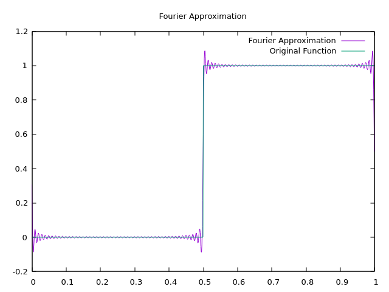

# Go Fourier Series Approximation

This project is a very simple example of how to calculate and plot a Fourier Series in Go. This can compute the Fourier series on any arbitrary function that can be numerically integrated that takes a single `float64` and outputs a `float64`.

## Example Usage

Example usages similar to the ones below are in `main.go`.

### Viewing Coefficients

```go
fSin := NewFourier(math.Cos, 0.0, 2.0*math.Pi, 5)
fSin.PrintHarmonics()
```

outputs the following:

```
n       an      bn
0       -0.000   0.000
1        1.000  -0.000
2       -0.000  -0.000
3       -0.000  -0.000
4       -0.000  -0.000
```

### Viewing Plots

The data is outputted in a manner that Gnuplot can easily work with.

```go
f := NewFourier(squareWave, 0.0, 1.0, 100)
f.CreatePlot("squarewave") // Creates squarewave.dat and squarewave.plt
```

Running `gnuplot squarewave.plt` then results in a plot similar to the one below:

